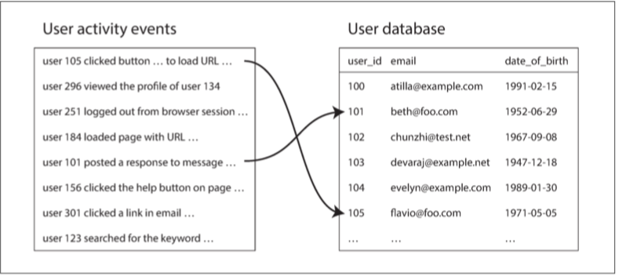
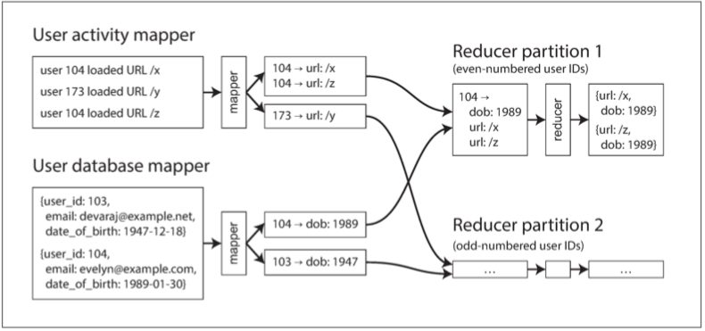

# 10. 批处理 

> 带有太强个人色彩的系统无法成功。当第一版健壮的设计完成时，不同的人们以自己的方式来测试，真正的考验才开始。
>
> ——高德纳

---------------

[TOC]

## 使用Unix工具的批处理

### 分析简单日志

### Unix哲学

## MapReduce和分布式文件系统

### MapReduce任务执行

**图10-1 具有三个Mapper和三个Reducer的MapReduce任务**

### Reduce端连接与分组

**图10-2 用户行为日志与用户档案的连接**

### Map端连接

**图10-3 Reduce端在user ID上进行归并排序连接，如果输入数据集分片成多个文件，则每个都会被多个Mapper并行处理**

### 工作流的输出

## 后MapReduce时代

### 内部状态表示

### 图与迭代处理

### 高级API和语言

## 本章小结

## 参考文献

1.  Jeffrey Dean and Sanjay Ghemawat:
    “[MapReduce: Simplified Data Processing on Large Clusters](http://research.google.com/archive/mapreduce.html),” at *6th USENIX Symposium on Operating System Design
    and Implementation* (OSDI), December 2004.

1.  Joel Spolsky:
    “[The Perils of JavaSchools](http://www.joelonsoftware.com/articles/ThePerilsofJavaSchools.html),” *joelonsoftware.com*, December 25, 2005.

1.  Shivnath Babu and Herodotos Herodotou:
    “[Massively Parallel Databases and MapReduce Systems](http://research.microsoft.com/pubs/206464/db-mr-survey-final.pdf),” *Foundations and Trends in Databases*,
    volume 5, number 1, pages 1–104, November 2013.
    [doi:10.1561/1900000036](http://dx.doi.org/10.1561/1900000036)

1.  David J. DeWitt and Michael Stonebraker:
    “[MapReduce: A Major Step Backwards](https://homes.cs.washington.edu/~billhowe/mapreduce_a_major_step_backwards.html),” originally published at *databasecolumn.vertica.com*, January 17, 2008.

1.  Henry Robinson:
    “[The Elephant Was a Trojan Horse: On the Death of Map-Reduce at Google](http://the-paper-trail.org/blog/the-elephant-was-a-trojan-horse-on-the-death-of-map-reduce-at-google/),”
    *the-paper-trail.org*, June 25, 2014.

1.  “[The Hollerith Machine](https://www.census.gov/history/www/innovations/technology/the_hollerith_tabulator.html),” United States Census Bureau, *census.gov*.

1.  “[IBM 82, 83, and 84 Sorters Reference Manual](http://www.textfiles.com/bitsavers/pdf/ibm/punchedCard/Sorter/A24-1034-1_82-83-84_sorters.pdf),” Edition A24-1034-1, International Business
    Machines Corporation, July 1962.

1.  Adam Drake:
    “[Command-Line Tools Can Be 235x Faster than Your Hadoop Cluster](http://aadrake.com/command-line-tools-can-be-235x-faster-than-your-hadoop-cluster.html),” *aadrake.com*, January 25, 2014.

1.  “[GNU Coreutils 8.23 Documentation](http://www.gnu.org/software/coreutils/manual/html_node/index.html),” Free Software Foundation, Inc., 2014.

1.  Martin Kleppmann:
    “[Kafka, Samza, and the Unix Philosophy of Distributed Data](http://martin.kleppmann.com/2015/08/05/kafka-samza-unix-philosophy-distributed-data.html),” *martin.kleppmann.com*, August 5, 2015.

1.  Doug McIlroy:
    [Internal Bell Labs memo](http://cm.bell-labs.com/cm/cs/who/dmr/mdmpipe.pdf),
    October 1964. Cited in: Dennis M. Richie:
    “[Advice from Doug McIlroy](https://www.bell-labs.com/usr/dmr/www/mdmpipe.html),”
    *cm.bell-labs.com*.

1.  M. D. McIlroy, E. N. Pinson, and B. A. Tague:
    “[UNIX Time-Sharing System: Foreword](https://archive.org/details/bstj57-6-1899),”
    *The Bell System Technical Journal*, volume 57, number 6, pages 1899–1904,
    July 1978.

1.  Eric S. Raymond:
    <a href="http://www.catb.org/~esr/writings/taoup/html/">*The Art of UNIX Programming*</a>.
    Addison-Wesley, 2003. ISBN: 978-0-13-142901-7

1.  Ronald Duncan:
    “[Text File Formats – ASCII Delimited Text – Not CSV or TAB Delimited Text](https://ronaldduncan.wordpress.com/2009/10/31/text-file-formats-ascii-delimited-text-not-csv-or-tab-delimited-text/),”
    *ronaldduncan.wordpress.com*, October 31, 2009.

1.  Alan Kay:
    “[Is 'Software Engineering' an Oxymoron?](http://tinlizzie.org/~takashi/IsSoftwareEngineeringAnOxymoron.pdf),” *tinlizzie.org*.

1.  Martin Fowler:
    “[InversionOfControl](http://martinfowler.com/bliki/InversionOfControl.html),”
    *martinfowler.com*, June 26, 2005.

1.  Daniel J. Bernstein:
    “[Two File Descriptors for Sockets](http://cr.yp.to/tcpip/twofd.html),” *cr.yp.to*.

1.  Rob Pike and Dennis M. Ritchie:
    “[The Styx Architecture for Distributed Systems](http://doc.cat-v.org/inferno/4th_edition/styx),” *Bell Labs Technical Journal*, volume 4, number 2, pages
146–152, April 1999.

1.  Sanjay Ghemawat, Howard Gobioff, and Shun-Tak
    Leung: “[The Google File System](http://research.google.com/archive/gfs-sosp2003.pdf),”
    at *19th ACM Symposium on Operating Systems Principles* (SOSP), October 2003.
    [doi:10.1145/945445.945450](http://dx.doi.org/10.1145/945445.945450)

1.  Michael Ovsiannikov, Silvius Rus, Damian Reeves, et al.:
    “[The Quantcast File System](http://db.disi.unitn.eu/pages/VLDBProgram/pdf/industry/p808-ovsiannikov.pdf),” *Proceedings of the VLDB Endowment*, volume 6, number 11, pages 1092–1101, August 2013.
    [doi:10.14778/2536222.2536234](http://dx.doi.org/10.14778/2536222.2536234)

1.  “[OpenStack Swift 2.6.1 Developer Documentation](http://docs.openstack.org/developer/swift/),” OpenStack Foundation, *docs.openstack.org*, March 2016.

1.  Zhe Zhang, Andrew Wang, Kai Zheng, et al.:
    “[Introduction to HDFS Erasure Coding in Apache Hadoop](http://blog.cloudera.com/blog/2015/09/introduction-to-hdfs-erasure-coding-in-apache-hadoop/),” *blog.cloudera.com*, September 23, 2015.

1.  Peter Cnudde:
    “[Hadoop Turns 10](http://yahoohadoop.tumblr.com/post/138739227316/hadoop-turns-10),”
    *yahoohadoop.tumblr.com*, February 5, 2016.

1.  Eric Baldeschwieler:
    “[Thinking About the HDFS vs. Other Storage Technologies](http://hortonworks.com/blog/thinking-about-the-hdfs-vs-other-storage-technologies/),” *hortonworks.com*, July 25, 2012.

1.  Brendan Gregg:
    “[Manta: Unix Meets Map Reduce](http://dtrace.org/blogs/brendan/2013/06/25/manta-unix-meets-map-reduce/),” *dtrace.org*, June 25, 2013.

1.  Tom White: *Hadoop: The Definitive Guide*,
    4th edition. O'Reilly Media, 2015. ISBN: 978-1-491-90163-2

1.  Jim N. Gray:
    “[Distributed Computing Economics](http://arxiv.org/pdf/cs/0403019.pdf),” Microsoft
    Research Tech Report MSR-TR-2003-24, March 2003.

1.  Márton Trencséni:
    “[Luigi vs Airflow vs Pinball](http://bytepawn.com/luigi-airflow-pinball.html),”
    *bytepawn.com*, February 6, 2016.

1.  Roshan Sumbaly, Jay Kreps, and Sam Shah:
    “[The 'Big Data' Ecosystem at LinkedIn](http://www.slideshare.net/s_shah/the-big-data-ecosystem-at-linkedin-23512853),” at *ACM International Conference on Management of Data*
    (SIGMOD), July 2013.
    [doi:10.1145/2463676.2463707](http://dx.doi.org/10.1145/2463676.2463707)

1.  Alan F. Gates, Olga Natkovich, Shubham Chopra, et al.:
    “[Building a High-Level Dataflow System on Top of Map-Reduce: The Pig Experience](http://www.vldb.org/pvldb/2/vldb09-1074.pdf),” at *35th International Conference on Very Large Data
    Bases* (VLDB), August 2009.

1.  Ashish Thusoo, Joydeep Sen Sarma, Namit Jain, et al.:
    “[Hive – A Petabyte Scale Data Warehouse Using Hadoop](http://i.stanford.edu/~ragho/hive-icde2010.pdf),” at *26th IEEE International Conference on Data Engineering* (ICDE), March 2010.
    [doi:10.1109/ICDE.2010.5447738](http://dx.doi.org/10.1109/ICDE.2010.5447738)

1.  “[Cascading 3.0 User Guide](http://docs.cascading.org/cascading/3.0/userguide/),” Concurrent, Inc., *docs.cascading.org*, January 2016.

1.  “[Apache Crunch User Guide](https://crunch.apache.org/user-guide.html),” Apache Software Foundation, *crunch.apache.org*.

1.  Craig Chambers, Ashish Raniwala, Frances
    Perry, et al.: “[FlumeJava: Easy, Efficient Data-Parallel Pipelines](https://research.google.com/pubs/archive/35650.pdf),” at *31st ACM SIGPLAN Conference on Programming Language
    Design and Implementation* (PLDI), June 2010.
    [doi:10.1145/1806596.1806638](http://dx.doi.org/10.1145/1806596.1806638)

1.  Jay Kreps:
    “[Why Local State is a Fundamental Primitive in Stream Processing](https://www.oreilly.com/ideas/why-local-state-is-a-fundamental-primitive-in-stream-processing),” *oreilly.com*, July 31, 2014.

1.  Martin Kleppmann:
    “[Rethinking Caching in Web Apps](http://martin.kleppmann.com/2012/10/01/rethinking-caching-in-web-apps.html),” *martin.kleppmann.com*, October 1, 2012.

1.  Mark Grover, Ted Malaska, Jonathan
    Seidman, and Gwen Shapira: *[Hadoop Application Architectures](http://shop.oreilly.com/product/0636920033196.do)*. O'Reilly Media, 2015. ISBN: 978-1-491-90004-8

1.  Philippe Ajoux, Nathan Bronson,
    Sanjeev Kumar, et al.:
    “[Challenges to Adopting Stronger Consistency at Scale](https://www.usenix.org/system/files/conference/hotos15/hotos15-paper-ajoux.pdf),” at *15th USENIX Workshop on Hot Topics in
    Operating Systems* (HotOS), May 2015.

1.  Sriranjan Manjunath:
    “[Skewed Join](https://wiki.apache.org/pig/PigSkewedJoinSpec),” *wiki.apache.org*,
    2009.

1.  David J. DeWitt, Jeffrey F. Naughton, Donovan A.
    Schneider, and S. Seshadri: “[Practical Skew Handling in Parallel Joins](http://www.vldb.org/conf/1992/P027.PDF),” at *18th International Conference on Very Large Data Bases* (VLDB), August 1992.

1.  Marcel Kornacker, Alexander Behm, Victor
    Bittorf, et al.: “[Impala: A Modern, Open-Source SQL Engine for Hadoop](http://pandis.net/resources/cidr15impala.pdf),” at *7th Biennial Conference on Innovative Data Systems
    Research* (CIDR), January 2015.

1.  Matthieu Monsch:
    “[Open-Sourcing PalDB, a Lightweight Companion for Storing Side Data](https://engineering.linkedin.com/blog/2015/10/open-sourcing-paldb--a-lightweight-companion-for-storing-side-da),” *engineering.linkedin.com*, October 26, 2015.

1.  Daniel Peng and Frank Dabek:
    “[Large-Scale Incremental Processing Using Distributed Transactions and Notifications](https://www.usenix.org/legacy/event/osdi10/tech/full_papers/Peng.pdf),” at *9th USENIX
    conference on Operating Systems Design and Implementation* (OSDI), October 2010.

1.  “["Cloudera Search User Guide,"](http://www.cloudera.com/documentation/cdh/5-1-x/Search/Cloudera-Search-User-Guide/Cloudera-Search-User-Guide.html) Cloudera, Inc., September 2015.

1.  Lili Wu, Sam Shah, Sean Choi, et al.:
    “[The Browsemaps: Collaborative Filtering at LinkedIn](http://ls13-www.cs.uni-dortmund.de/homepage/rsweb2014/papers/rsweb2014_submission_3.pdf),” at *6th Workshop on Recommender Systems and
    the Social Web* (RSWeb), October 2014.

1.  Roshan Sumbaly, Jay Kreps, Lei Gao, et al.:
    “[Serving Large-Scale Batch Computed Data with Project Voldemort](http://static.usenix.org/events/fast12/tech/full_papers/Sumbaly.pdf),” at *10th USENIX Conference on File and Storage
    Technologies* (FAST), February 2012.

1.  Varun Sharma:
    “[Open-Sourcing Terrapin: A Serving System for Batch Generated Data](https://engineering.pinterest.com/blog/open-sourcing-terrapin-serving-system-batch-generated-data-0),” *engineering.pinterest.com*, September 14, 2015.

1.  Nathan Marz:
    “[ElephantDB](http://www.slideshare.net/nathanmarz/elephantdb),” *slideshare.net*, May 30, 2011.

1.  Jean-Daniel (JD) Cryans:
    “[How-to: Use HBase Bulk Loading, and Why](http://blog.cloudera.com/blog/2013/09/how-to-use-hbase-bulk-loading-and-why/),” *blog.cloudera.com*, September 27, 2013.

1.  Nathan Marz:
      “[How to Beat the CAP   Theorem](http://nathanmarz.com/blog/how-to-beat-the-cap-theorem.html),” *nathanmarz.com*, October 13, 2011.

1.  Molly Bartlett Dishman and Martin Fowler:
      “[Agile   Architecture](http://conferences.oreilly.com/software-architecture/sa2015/public/schedule/detail/40388),” at *O'Reilly Software Architecture Conference*, March 2015.

1.  David J. DeWitt and Jim N. Gray:
    “[Parallel Database Systems: The Future of High Performance Database Systems](http://www.cs.cmu.edu/~pavlo/courses/fall2013/static/papers/dewittgray92.pdf),”
    *Communications of the ACM*, volume 35, number 6, pages 85–98, June 1992.
    [doi:10.1145/129888.129894](http://dx.doi.org/10.1145/129888.129894)

1.  Jay Kreps:
    “[But the multi-tenancy thing is actually really really hard](https://twitter.com/jaykreps/status/528235702480142336),” tweetstorm, *twitter.com*, October 31, 2014.

1.  Jeffrey Cohen, Brian Dolan, Mark Dunlap, et al.: “[MAD Skills: New Analysis Practices for Big Data](http://www.vldb.org/pvldb/2/vldb09-219.pdf),” *Proceedings of the VLDB Endowment*, volume 2, number
    2, pages 1481–1492, August 2009.
    [doi:10.14778/1687553.1687576](http://dx.doi.org/10.14778/1687553.1687576)

1.  Ignacio
    Terrizzano, Peter Schwarz, Mary Roth, and John E. Colino:
    “[Data Wrangling: The Challenging Journey from the Wild to the Lake](http://cidrdb.org/cidr2015/Papers/CIDR15_Paper2.pdf),” at *7th Biennial Conference on Innovative Data Systems
    Research* (CIDR), January 2015.

1.  Paige Roberts:
    “[To Schema on Read or to Schema on Write, That Is the Hadoop Data Lake Question](http://adaptivesystemsinc.com/blog/to-schema-on-read-or-to-schema-on-write-that-is-the-hadoop-data-lake-question/),” *adaptivesystemsinc.com*, July 2, 2015.

1.  Bobby Johnson and Joseph Adler:
    “[The Sushi Principle: Raw Data Is Better](https://vimeo.com/123985284),” at
    *Strata+Hadoop World*, February 2015.

1.  Vinod Kumar Vavilapalli, Arun C. Murthy, Chris Douglas, et al.:
    “[Apache Hadoop YARN: Yet Another Resource Negotiator](http://www.socc2013.org/home/program/a5-vavilapalli.pdf),” at *4th ACM Symposium on Cloud Computing* (SoCC), October 2013.
    [doi:10.1145/2523616.2523633](http://dx.doi.org/10.1145/2523616.2523633)

1.  Abhishek Verma, Luis Pedrosa, Madhukar Korupolu, et al.:
    “[Large-Scale Cluster Management at Google with Borg](http://research.google.com/pubs/pub43438.html),” at *10th European Conference on Computer Systems* (EuroSys), April 2015.
    [doi:10.1145/2741948.2741964](http://dx.doi.org/10.1145/2741948.2741964)

1.  Malte Schwarzkopf:
    “[The Evolution of Cluster Scheduler Architectures](http://www.firmament.io/blog/scheduler-architectures.html),” *firmament.io*, March 9, 2016.

1.  Matei Zaharia, Mosharaf Chowdhury, Tathagata Das, et al.:
    “[Resilient Distributed Datasets: A Fault-Tolerant Abstraction for In-Memory Cluster Computing](https://www.usenix.org/system/files/conference/nsdi12/nsdi12-final138.pdf),” at *9th
    USENIX Symposium on Networked Systems Design and Implementation* (NSDI), April 2012.

1.  Holden Karau, Andy Konwinski, Patrick Wendell, and Matei
    Zaharia: *Learning Spark*. O'Reilly Media, 2015. ISBN: 978-1-449-35904-1

1.  Bikas Saha and Hitesh Shah:
    “[Apache Tez: Accelerating Hadoop Query Processing](http://www.slideshare.net/Hadoop_Summit/w-1205phall1saha),” at *Hadoop Summit*, June 2014.

1.  Bikas Saha, Hitesh Shah, Siddharth Seth, et al.:
    “[Apache Tez: A Unifying Framework for Modeling and Building Data Processing Applications](http://home.cse.ust.hk/~weiwa/teaching/Fall15-COMP6611B/reading_list/Tez.pdf),” at *ACM
    International Conference on Management of Data* (SIGMOD), June 2015.
    [doi:10.1145/2723372.2742790](http://dx.doi.org/10.1145/2723372.2742790)

1.  Kostas Tzoumas:
    “[Apache Flink: API, Runtime, and Project Roadmap](http://www.slideshare.net/KostasTzoumas/apache-flink-api-runtime-and-project-roadmap),” *slideshare.net*, January 14, 2015.

1.  Alexander Alexandrov, Rico Bergmann, Stephan Ewen, et al.:
    “[The Stratosphere Platform for Big Data Analytics](https://ssc.io/pdf/2014-VLDBJ_Stratosphere_Overview.pdf),” *The VLDB Journal*, volume 23, number 6, pages 939–964, May 2014.
    [doi:10.1007/s00778-014-0357-y](http://dx.doi.org/10.1007/s00778-014-0357-y)

1.  Michael Isard, Mihai Budiu, Yuan Yu, et al.:
    “[Dryad: Distributed Data-Parallel Programs from Sequential Building Blocks](http://research.microsoft.com/en-us/projects/dryad/eurosys07.pdf),” at *European Conference on Computer
    Systems* (EuroSys), March 2007.
    [doi:10.1145/1272996.1273005](http://dx.doi.org/10.1145/1272996.1273005)

1.  Daniel Warneke and Odej Kao:
    “[Nephele: Efficient Parallel Data Processing in the Cloud](https://stratosphere2.dima.tu-berlin.de/assets/papers/Nephele_09.pdf),” at *2nd Workshop on Many-Task Computing on Grids and
    Supercomputers* (MTAGS), November 2009.
    [doi:10.1145/1646468.1646476](http://dx.doi.org/10.1145/1646468.1646476)

1.  Lawrence Page, Sergey Brin, Rajeev
    Motwani, and Terry Winograd: “<a href="http://ilpubs.stanford.edu:8090/422/">The PageRank

1.  Leslie G. Valiant:
    “[A Bridging Model for Parallel Computation](http://dl.acm.org/citation.cfm?id=79181),”
    *Communications of the ACM*, volume 33, number 8, pages 103–111, August 1990.
    [doi:10.1145/79173.79181](http://dx.doi.org/10.1145/79173.79181)

1.  Stephan Ewen, Kostas Tzoumas, Moritz Kaufmann, and Volker Markl:
    “[Spinning Fast Iterative Data Flows](http://vldb.org/pvldb/vol5/p1268_stephanewen_vldb2012.pdf),” *Proceedings of the VLDB Endowment*, volume 5, number 11, pages 1268-1279, July 2012.
    [doi:10.14778/2350229.2350245](http://dx.doi.org/10.14778/2350229.2350245)

1.  Grzegorz Malewicz, Matthew H.
    Austern, Aart J. C. Bik, et al.: “[Pregel: A System for Large-Scale Graph Processing](https://kowshik.github.io/JPregel/pregel_paper.pdf),” at *ACM International Conference on Management of
    Data* (SIGMOD), June 2010.
    [doi:10.1145/1807167.1807184](http://dx.doi.org/10.1145/1807167.1807184)

1.  Frank McSherry, Michael Isard, and Derek G. Murray:
    “[Scalability! But at What COST?](http://www.frankmcsherry.org/assets/COST.pdf),” at
    *15th USENIX Workshop on Hot Topics in Operating Systems* (HotOS), May 2015.

1.  Ionel Gog, Malte Schwarzkopf, Natacha Crooks, et al.:
    “[Musketeer: All for One, One for All in Data Processing Systems](http://www.cl.cam.ac.uk/research/srg/netos/camsas/pubs/eurosys15-musketeer.pdf),” at *10th European Conference on
    Computer Systems* (EuroSys), April 2015.
    [doi:10.1145/2741948.2741968](http://dx.doi.org/10.1145/2741948.2741968)

1.  Aapo Kyrola, Guy Blelloch, and Carlos Guestrin:
    “[GraphChi: Large-Scale Graph Computation on Just a PC](https://www.usenix.org/system/files/conference/osdi12/osdi12-final-126.pdf),” at *10th USENIX Symposium on Operating Systems
    Design and Implementation* (OSDI), October 2012.

1.  Andrew Lenharth, Donald Nguyen, and Keshav Pingali:
    “[Parallel Graph Analytics](http://cacm.acm.org/magazines/2016/5/201591-parallel-graph-analytics/fulltext),” *Communications of the ACM*, volume 59, number 5, pages 78–87, May
    2016. [doi:10.1145/2901919](http://dx.doi.org/10.1145/2901919)

1.  Fabian Hüske:
    “[Peeking into Apache Flink's Engine Room](http://flink.apache.org/news/2015/03/13/peeking-into-Apache-Flinks-Engine-Room.html),” *flink.apache.org*, March 13, 2015.

1.  Mostafa Mokhtar:
    “[Hive 0.14 Cost Based Optimizer (CBO) Technical Overview](http://hortonworks.com/blog/hive-0-14-cost-based-optimizer-cbo-technical-overview/),” *hortonworks.com*, March 2, 2015.

1.  Michael Armbrust, Reynold S Xin, Cheng Lian, et al.:
    “[Spark SQL: Relational Data Processing in Spark](http://people.csail.mit.edu/matei/papers/2015/sigmod_spark_sql.pdf),” at *ACM International Conference on Management of Data* (SIGMOD), June 2015.
    [doi:10.1145/2723372.2742797](http://dx.doi.org/10.1145/2723372.2742797)

1.  Daniel Blazevski:
    “[Planting Quadtrees for Apache Flink](http://insightdataengineering.com/blog/flink-knn/),” *insightdataengineering.com*, March 25, 2016.

1.  Tom White:
    “[Genome Analysis Toolkit: Now Using Apache Spark for Data Processing](http://blog.cloudera.com/blog/2016/04/genome-analysis-toolkit-now-using-apache-spark-for-data-processing/),” *blog.cloudera.com*, April 6, 2016.

